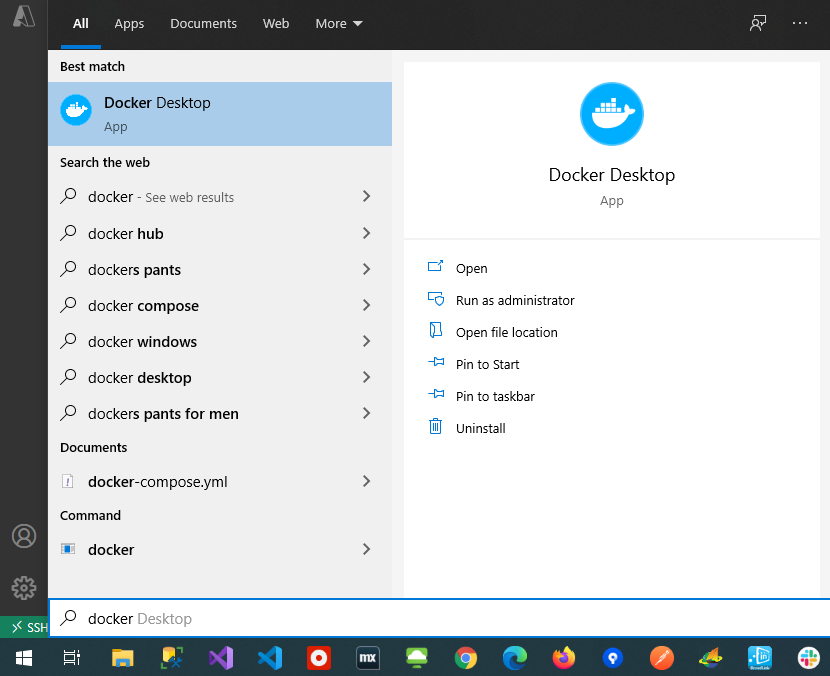
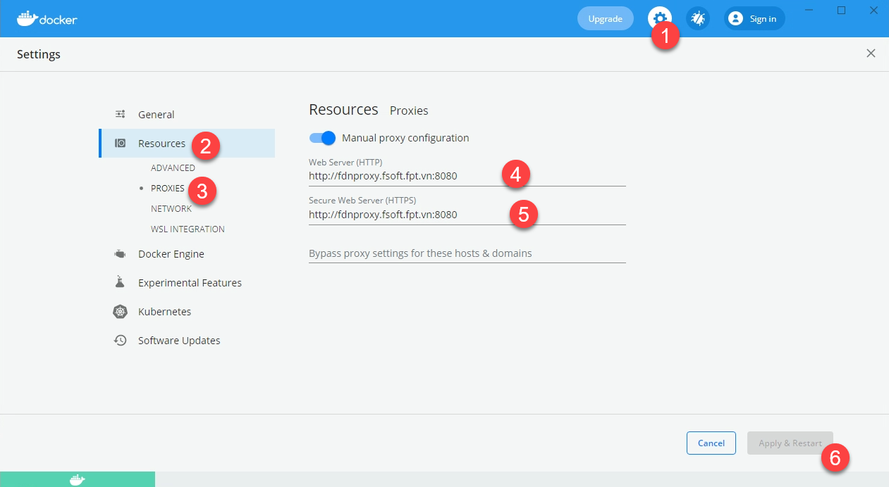
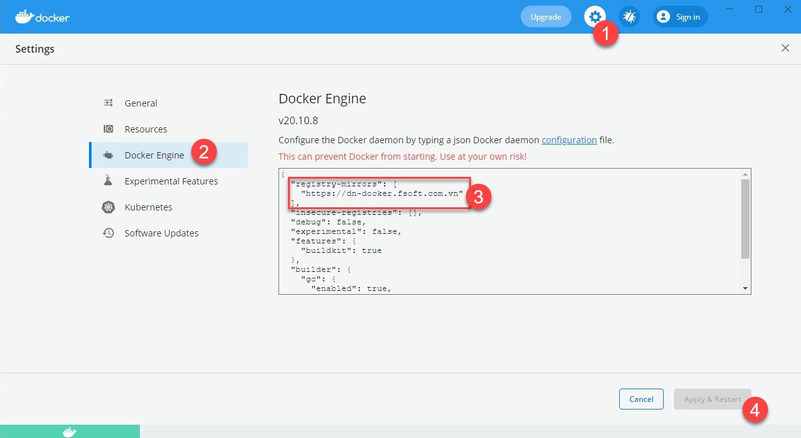
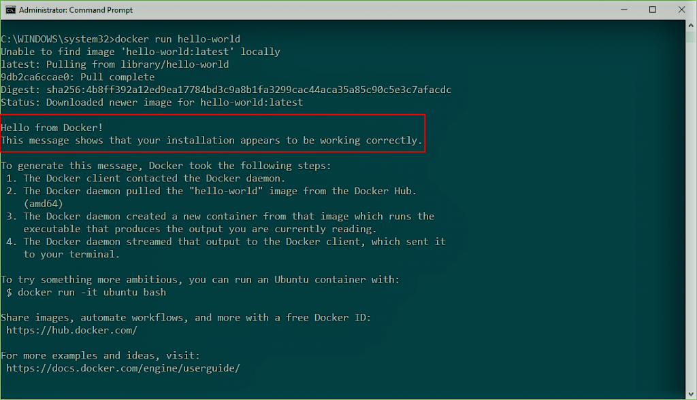

# What is Docker ?

Docker is an OS-level virtualization software platform that helps users in building and managing applications in the Docker environment with all its library dependencies.

# Docker Installation

1. Go to the website https://docs.docker.com/docker-for-windows/install/ and download the docker file.

2. Then, double-click on the Docker Desktop Installer.exe to run the installer.

3. Once you start the installation process, always enable **Hyper-V Windows Feature** on the Configuration page. (follow: https://docs.microsoft.com/en-us/virtualization/hyper-v-on-windows/quick-start/enable-hyper-v)

4. Then, follow the installation process to allow the installer and wait till the process is done.

5. After completion of the installation process, click Close and restart. 

# Start Docker Desktop Tool

After the installation process is complete, the tool does not start automatically. To start the Docker tool, search for the tool, and select Docker Desktop in your desktop search results.



From the Docker Desktop menu, you can toggle which daemon (Linux or Windows) the Docker CLI talks to. Select Switch to Windows containers to use Windows containers, or select Switch to Linux containers to use Linux containers (the default).


# FPT configuration (proxy)

On docker windows settings

http://fdnproxy.fsoft.fpt.vn:8080



docker registry mirror

```
"registry-mirrors": [
    "https://dn-docker.fsoft.com.vn"
]
```




# Run Docker Hello World image provided by Docker

Now issue following command to run hello world container

`docker run hello-world`



# What is Docker Compose

Compose is a tool for defining and running multi-container Docker applications. With Compose, you use a YAML file to configure your application's services.

# Install Docker Compose

Docker Desktop for Windows includes Compose along with other Docker apps, so most Windows users do not need to install Compose separately.

# 
docker-compose up